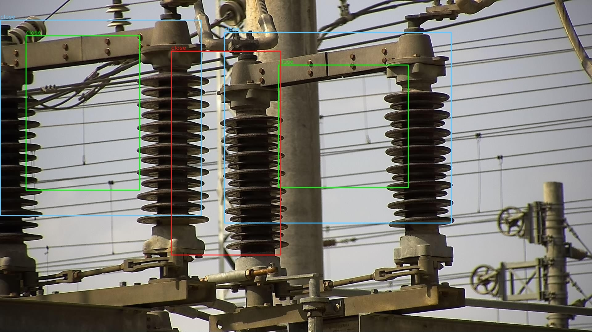
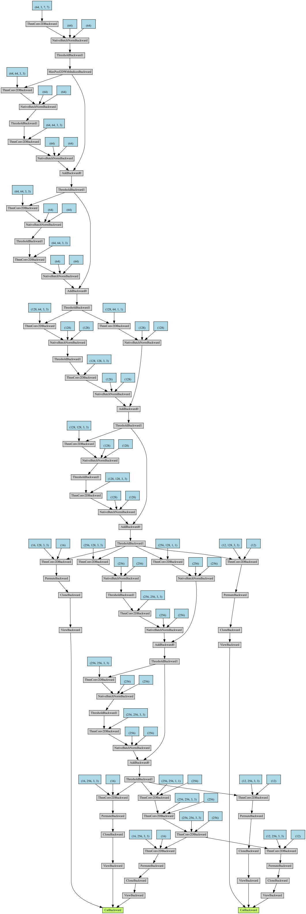

# January detection network

This is a rough combination of YOLOv3 and SSD. I train it on my custom _switch_ dataset and try to
write all stuff from scratch to train my pytorch skill :laughing:.

## Usage

### train

```
$ python train.py
```

Change config class in the script to config the training.

### detect

See `detect-test.py` and `test.py`

## Result



All boxes looks too small! It may be caused by YOLO style exponential scale encoding.

## Structure

The network collect three feature map from first two residual blocks from ResNet-18 and a extra 
3 layer block, and generate `loc` and `conf` map with only one extra conv layer.

The data is resized to 400x400 to leverage the big receptive field introduced by ResNet compared to
VGG used by SSD. The output of network is seen as YOLO style translating encoding, then the predict
box with correspoding prior box matched with a ground truth box using SSD style matching rule will
be accumulated into the localization loss using smooth L1 loss. Next, matched predict box and part of 
background boxes, that are marked as hard example by sorting, will join the confidence loss.



It looks like PyTorchViz always give weird result even for this relative simple network!

Long live, the elder :frog:!